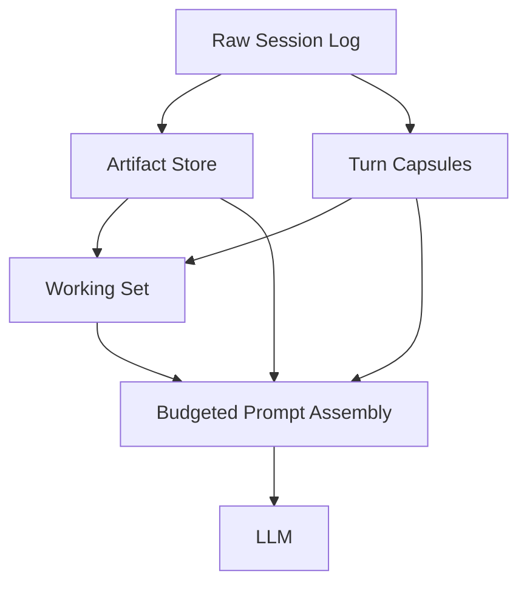

# 上下文工作集优化方案

## 1. 目标

本方案用于定义 nanobot 新短期上下文主链的实现合同。目标不是继续优化旧 `session.messages` 尾部拼接，而是将模型运行时主输入改造成结构化工作集驱动。

本方案的最终目标：

- 用 `WorkingSetSnapshot` 替代 `working/CURRENT.md` 的运行时主状态职责
- 用 `ArtifactRecord` 承接大工具结果，而不是依赖 tool message 截断
- 用 `TurnCapsule` 承接回合级结构化结论
- 用分层 `Prompt Assembly` 替代原始 history 平铺装配
- 让 Prompt、恢复、AutoCompact、Dream 共用同一套短期结构化对象

## 2. 当前问题

当前短期上下文的主要问题不在“历史太长”，而在“主输入边界错误”。

### 2.1 原始消息尾部仍是主输入

当前 `ContextBuilder.build_messages()` 仍主要依赖 `history`。这会导致：

- prompt 体积随消息条数线性增长
- 历史探索记录和当前任务争抢预算
- 当前关键约束无法被稳定保留

### 2.2 工具结果只保留动作痕迹，不保留稳定证据

当前大工具结果会被截断、压缩或外置成引用字符串，但缺少统一结构化对象。结果是模型常常记得“做过什么”，却不记得“得到什么”。

### 2.3 当前工作状态没有统一主载体

当前系统缺少一个明确的运行时工作内存对象来稳定表达：

- 当前任务目标
- 当前任务阶段
- 打开的待办循环
- 仍然相关的 capsule
- 仍然相关的 artifact

### 2.4 旧主链容易与恢复、Dream、idle compact 脱节

如果短期上下文仍主要由 history 尾部决定，则恢复、AutoCompact 和 Dream 只能继续从旧消息或旧摘要反推当前状态，无法共享同一份稳定输入。

## 3. 设计原则

- 日志层与工作层分离：原始日志继续保真，Prompt 主链只读取工作层
- 先结构化，再裁剪：先生成结构化对象，再做预算控制
- 单一主输入：运行时主输入只能是 `WorkingSetSnapshot + 结构化补充对象`
- 当前任务优先：当前目标、阶段、关键约束必须有稳定预算
- 大结果句柄化：默认看 artifact render，不直接回灌 raw payload
- 最终删除旧主链：旧 history 尾部和 `CURRENT.md` 不得继续作为主状态输入

## 4. 核心对象

本方案中的短期主链由四类对象组成：

1. `WorkingSetSnapshot`
2. `ArtifactRecord`
3. `TurnCapsule`
4. `Recent Raw Turns`

### 4.1 WorkingSetSnapshot

`WorkingSetSnapshot` 是当前任务阶段的主工作内存，不是长期记忆，也不是完整历史。

建议字段：

```python
WorkingSetSnapshot = {
    "session_key": str,
    "version": int,
    "source_turn_id": str | None,
    "source_revision": int | None,
    "is_stable": bool,
    "published_by": str,  # agent_loop | autocompact_candidate
    "active_task": str | None,
    "task_stage": str | None,
    "active_goals": list[str],
    "open_loops": list[str],
    "last_user_focus": str | None,
    "relevant_capsule_refs": list[str],
    "relevant_artifact_refs": list[str],
    "budget_hints": dict,
    "source_turn_ids": list[str],
    "created_at": str,
}
```

约束：

- 只能追加新版本，不能原地覆写
- Prompt 只能读取最后一次稳定版本
- 未完成 turn 不得发布 stable working set
- `latest-working-set.json` 只能指向 stable snapshot
- `published_by=autocompact_candidate` 的 snapshot 不得自动晋升为主 working set

### 4.2 ArtifactRecord

`ArtifactRecord` 用于承接大工具结果，避免把原文直接拼进 prompt。

建议字段：

```python
ArtifactRecord = {
    "artifact_id": str,
    "session_key": str,
    "turn_id": str,
    "tool_call_id": str | None,
    "declared_revision": int,
    "source_type": str,
    "source_input": dict,
    "raw_ref": str,
    "digest": str,
    "size_chars": int,
    "freshness_policy": str,  # immutable | file_bound | command_bound | time_bound
    "content_version": str | None,
    "invalidated_by": list[str],
    "created_at": str,
}
```

约束：

- `read_file` artifact 必须带文件版本信息
- `exec` artifact 必须带命令签名和工作目录
- digest 不是失效语义的替代品
- stale revision 的结果可保留审计价值，但默认不得进入 stable working set

### 4.3 TurnCapsule

`TurnCapsule` 是回合级结构化单元，用来替代未经整理的旧消息块。

建议字段：

```python
TurnCapsule = {
    "capsule_id": str,
    "turn_id": str,
    "session_key": str,
    "source_revision": int,
    "user_goal": str,
    "assistant_intent": str,
    "decisions": list[str],
    "outcomes": list[str],
    "open_questions": list[str],
    "artifact_refs": list[str],
    "next_expected_action": str | None,
    "capsule_version": int,
    "created_at": str,
}
```

约束：

- 每个已稳定完成的 `turn_id` 最终只能对应一个稳定 capsule
- 若恢复时需要补生成，必须保证不会产生多个稳定版本

### 4.4 Recent Raw Turns

保留 `Recent Raw Turns` 的原因不是延续旧主链，而是为结构化对象尚未覆盖的细节提供最小必要上下文。

约束：

- 只是补充层，不是主输入层
- 优先级低于 `WorkingSetSnapshot`
- 默认只保留较近、合法、最小必要的 raw turns

## 5. Prompt Assembly 合同

新的 prompt 构建必须采用显式分层装配，而不是消息平铺。

### 5.1 固定组装顺序

1. `System Prefix`
2. `WorkingSetSnapshot`
3. `Recent Raw Turns`
4. `Selected TurnCapsules`
5. `Selected Artifact Render`
6. `Current User Message`

### 5.2 固定裁剪顺序

1. 低相关 capsule
2. 低相关 artifact render
3. 较旧 raw turns
4. budget hints
5. 不裁 system
6. 不轻易裁 stable working set

### 5.3 ContextBuilder 输入合同

`nanobot/agent/context.py` 应切换到显式结构化输入：

```python
def build_messages(
    self,
    *,
    working_set: dict | None,
    recent_raw_turns: list[dict],
    selected_capsules: list[dict],
    selected_artifacts: list[dict],
    current_message: str,
    media: list[str] | None = None,
    channel: str | None = None,
    chat_id: str | None = None,
    current_role: str = "user",
) -> list[dict[str, Any]]:
    ...
```

要求：

- 禁止再以 `session.get_history()` 作为 prompt 主输入
- 保留 system prompt 稳定性
- 保留 channel hint
- 保留 runtime context 注入
- 保留多模态处理和同 role 合并

## 6. Artifact 投影合同

为了避免实现时退化回“raw payload 回灌”，每个 artifact 必须至少支持三种投影视图：

- `render_for_prompt(budget_chars: int) -> str`
- `render_for_capsule() -> dict | str`
- `render_for_dream() -> dict`

要求：

- prompt 默认读取 render 结果，而不是直接拼 raw payload
- capsule 和 Dream 可以读取更适合各自语义的结构化投影
- 失效 artifact 默认不继续进入新的 stable working set

## 7. 存储和引用约束

### 7.1 统一引用协议

所有对象引用统一使用 `<kind>:<id>`：

- `message:<message_id>`
- `response:<response_id>`
- `artifact:<artifact_id>`
- `capsule:<capsule_id>`
- `commit:<commit_id>`

### 7.2 解引用原则

- 业务层不得直接拼文件路径读取对象
- 所有消费方必须通过统一 `resolve_ref()` 解引用

## 8. 与现有模块的整合

### 8.1 `nanobot/agent/context.py`

重点改造：

- 从 `history` 主驱动改成 `working set` 主驱动
- 引入显式 Prompt Assembly
- 支持 capsule 和 artifact render 选择性注入

### 8.2 `nanobot/agent/loop.py`

重点改造：

- turn 完成时生成 capsule
- turn 收口时发布 stable working set
- 注入消息导致 revision 变化时，推动 working set 版本更新

### 8.3 `nanobot/agent/runner.py`

重点改造：

- 工具结果进入 artifact store
- `_microcompact()` / `_snip_history()` 退出主路径
- tool message 截断不再承担主 token 治理职责

### 8.4 `nanobot/agent/autocompact.py`

重点改造：

- idle compact 不再生成需要直接注回 prompt 的自然语言 summary
- 只允许生成 candidate snapshot / capsule 辅助对象

### 8.5 `nanobot/agent/memory.py`

重点改造：

- Dream 不再从 `CURRENT.md + history.jsonl` 推断当前短期状态
- Dream 必须消费结构化短期对象

## 9. 切换原则

### 9.1 迁移窗口

迁移期间允许双写，但不允许双主读：

- 一个阶段只能有一个明确主读源
- 双写只用于迁移和回滚
- 迁移窗口结束后，旧主路径必须删除

### 9.2 最终态

最终允许保留的只有非主架构产物：

- `sessions/*.jsonl`：原始审计日志
- `archive/history.jsonl`：长期审计 / Dream 历史输入
- `working/CURRENT.md`：如保留，仅允许作为新结构的镜像导出

以下路径不得继续作为短期上下文主链：

- `session.messages` 尾部
- `_microcompact()` 主路径
- `_snip_history()` 主路径
- `working/CURRENT.md` 主输入

## 10. 分阶段实施要求

### 阶段 0

先同步文档合同，不改生产代码。

### 阶段 1

先落地 state store 和 schema，不切主执行链。

### 阶段 2

将 Prompt Assembly 切到结构化输入，但暂保留 raw turn 回退层。

### 阶段 3+

再逐步切换 TurnState、Artifact、publish/repair、AutoCompact、Dream。

任何阶段都不得直接跳到“删除旧路径”而不先完成主链切换和测试验证。

## 11. 验收标准

本方案完成后，必须满足：

- 短期上下文主输入不再是 `session.messages` 尾部
- `WorkingSetSnapshot` 成为运行时主状态
- `ArtifactRecord` 成为大工具结果的主承载对象
- Prompt 只通过结构化对象和 raw turn 补充层组装
- `CURRENT.md` 不再承担主输入职责
- AutoCompact 和 Dream 不再从旧短期文件反推当前主状态

## 12. 总结

本方案的核心不是“更聪明地裁消息”，而是把短期上下文重构为：

- 一个稳定的当前工作集
- 一组可复用的工具产物
- 一组可选择注入的回合胶囊
- 一层最小必要的 recent raw turns

最终目标是让短期上下文从“history 尾部驱动”升级为“结构化工作集驱动”。
# 上下文工作集优化方案

## 1. 目标

本方案聚焦解决短期上下文输入质量问题，核心目标不是“让模型看到更多历史”，而是“让模型在每一步优先看到当前真正需要的信息”。

具体目标：

- 让 prompt 增长速度低于原始消息增长速度
- 避免长 `historyText` 挤占当前任务的注意力预算
- 保留可复用结论，而不是只保留“执行过某个动作”
- 降低重复 `read_file`、重复搜索、重复跑测试的概率
- 为后续 `embedding` / `Hybrid RAG` 扩展预留结构化边界

## 2. 主要问题

当前主问题可归并为三类：

### 2.1 原始历史仍是短期记忆主载体

当前短期上下文仍然主要依赖 `session.messages` 尾部拼接。这样会导致：

- prompt 体积随消息条数线性膨胀
- 历史探索记录与当前任务竞争 token
- 当前关键约束缺少稳定保留空间

### 2.2 tool 结果压缩过于粗粒度

将旧工具结果压成占位符虽然节省 token，但会丢失：

- 具体文件路径
- 关键配置值
- 测试失败点
- 对后续推理仍然重要的证据

结果是模型记得“做过”，却不记得“结果是什么”。

### 2.3 prompt 组装缺少显式预算层次

当前 prompt 更接近把 system、history 和 user message 平铺后一起竞争预算，而不是按优先级装配。这会导致：

- 当前工作集没有稳定保留空间
- 历史探索记录容易压过当前任务信息
- 模型开始执行时仍然漏掉最关键约束

## 3. 设计原则

- **日志层与工作层分离**：原始日志保真存储，模型主输入改为工作集
- **先结构化，再压缩**：先形成结构化中间层，再做预算裁剪
- **大结果句柄化**：长工具输出保存在 artifact 中，prompt 默认只看 digest
- **当前任务优先**：prompt 中稳定保留当前 active task、open loops、相关证据
- **按需追溯**：更早历史只在必要时通过 capsule、artifact 或 hydrate 回取
- **对检索增强兼容**：未来可加入 `embedding` / `Hybrid RAG`，但不退化回 `historyText` 中心

## 4. 核心方案

本子方案由 4 个核心组件组成：

1. `Artifact Store`
2. `Turn Capsule`
3. `Working Set`
4. `Budgeted Prompt Assembly`

### 4.1 Artifact Store

#### 目标

把大执行产物从 prompt 中剥离出去，改成“句柄 + 摘要”的复用方式。

#### 适用对象

- `read_file`
- `grep`
- `glob`
- `exec`
- `web_fetch`
- `web_search`
- 后续扩展到 MCP、browser、subagent report 等

#### 建议字段

- `artifact_id`
- `source_type`
- `source_name`
- `created_at`
- `source_input`
- `raw_ref`
- `digest`
- `size_chars`
- `reuse_hint`

#### 核心收益

- 长输出默认不再直接进入 prompt
- 模型保留“可复用结果”而不是只保留执行痕迹
- 后续可以围绕 `artifact digest` 做检索或 hydrate

### 4.2 Turn Capsule

#### 目标

把一个用户回合整理成结构化语义单元，用来替代未经整理的旧消息块。

#### 建议内容

- `turn_id`
- `user_goal`
- `assistant_intent`
- `outcomes`
- `decisions`
- `open_questions`
- `artifact_refs`
- `next_expected_action`

#### 核心收益

- 旧历史不再只能按 message 粗粒度裁剪
- 历史信息可以按“任务单元”选择性注入
- 为后续语义检索提供比原始消息更好的对象

### 4.3 Working Set

#### 目标

显式维护“模型当前真正需要知道什么”。

#### 建议内容

- `active_task`
- `task_stage`
- `active_goals`
- `open_loops`
- `relevant_capsules`
- `relevant_artifacts`
- `last_user_focus`
- `budget_cache`

#### 定位

`Working Set` 不是长期记忆，也不是完整历史，而是当前任务阶段的主工作内存。

#### 核心收益

- 当前目标与关键约束稳定存在
- prompt 不再被动依赖最近消息尾部
- 为恢复、检索、预算控制提供统一载体

### 4.4 Budgeted Prompt Assembly

#### 目标

把 prompt 构建从“按消息堆叠”改成“按层次装配”。

#### 推荐组装顺序

1. `System Prefix`
2. `Working Set`
3. `Recent Raw Turns`
4. `Selected Turn Capsules`
5. `Artifact Digests`
6. `Current User Message`

#### 优先裁剪顺序

- 先裁低相关 `capsule`
- 再裁低相关 `artifact digest`
- 再裁较旧 `raw turn`
- 不轻易裁 `working set`
- 不裁稳定 `system prefix`

#### 核心收益

- 上下文膨胀从“按消息数量增长”转成“按活跃任务复杂度增长”
- 当前任务信息有稳定预算
- 历史信息只有在相关且值得时才占用空间

## 5. 数据流



核心思路是：

- `Raw Session Log` 继续保存事实
- `Artifact Store` 承接大结果
- `Turn Capsule` 承接结构化回合语义
- `Working Set` 承接当前任务状态
- Prompt 构建时优先注入 `Working Set`

## 6. 与现有模块的整合

### 6.1 `nanobot/agent/runner.py`

重点改造：

- 将 `_microcompact()` 升级为 tool-aware digest 机制
- 大输出统一注册到 `Artifact Store`
- 保留现有 orphan repair / history snip 作为兜底层

### 6.2 `nanobot/agent/context.py`

重点改造：

- 从 `history` 驱动改成 `working set` 驱动
- 引入分层预算 prompt assembly
- 支持 `selected capsules` / `artifact digests` 注入

### 6.3 `nanobot/agent/loop.py`

重点改造：

- turn 完成时生成 `Turn Capsule`
- 更新 `Working Set`
- 为后续恢复与检索提供结构化输入

### 6.4 `nanobot/agent/autocompact.py`

重点改造：

- idle compact 不再只产出自由文本 summary
- 优先产出 capsule / state snapshot
- 恢复时优先注入 `Working Set` 级摘要

## 7. 分阶段实施

### Phase 1：Artifact Store + Working Set

目标：

- 先解决大输出重复发送
- 先建立工作集主输入路径
- 先把 prompt 改成分层预算装配

产出：

- artifact digest
- working set sidecar
- prompt 分层预算初版

### Phase 2：Turn Capsule

目标：

- 让在线短期记忆从“消息尾部”升级为“结构化回合单元”

产出：

- 每回合 capsule 生成
- capsule 选择性注入
- 与 `Working Set` 协同

### Phase 3：检索增强（可选）

目标：

- 在保持 `Working Set` 主路径不变的前提下增强历史追溯能力

建议方式：

- 优先检索 `Turn Capsule`
- 其次检索 `Artifact Digest`
- `Raw Log Chunk` 只做兜底
- 采用 metadata + embedding + rerank 的组合方式

## 8. 风险与对策

### 8.1 风险：working set 漂移

如果 `Working Set` 与真实任务状态不一致，模型会基于错误上下文继续工作。

对策：

- `Working Set` 只存可验证字段
- 关键内容优先来自 `Turn Capsule` 和 `Artifact Digest`
- turn 完成后统一刷新，避免中途频繁重写

### 8.2 风险：artifact digest 过于简化

如果 digest 太粗，模型仍会重复读取文件或重复跑测试。

对策：

- 先做规则化 digest
- 对重复 re-read / re-run 场景埋点
- 只在高价值工具上逐步增强摘要粒度

### 8.3 风险：检索层引入噪音

后续如果接入 `embedding` / `Hybrid RAG`，可能召回语义相关但当前无用的历史。

对策：

- 先做 metadata 过滤，再做语义召回
- 控制每轮注入数量与 token 上限
- 让检索结果先进入 `Working Set` 候选，而不是直接灌进 prompt

## 9. 验收指标

- 平均 `prompt_tokens` 增长斜率下降
- 单任务最大上下文峰值下降
- raw history 与实际 prompt 大小比值下降
- 重复 `read_file` / `web_fetch` / `exec` 次数下降
- 大输出重复发送率下降
- artifact digest 命中率提升

## 10. 首期实现建议

如果只做第一版最小可用改造，建议优先落地：

1. `Artifact Store`
2. `Working Set`
3. `Prompt 分层预算组装`

原因是这三项可以先解决：

- 长历史挤占上下文
- 工具结果只有动作痕迹没有可复用结论
- 当前任务信息没有稳定预算

## 11. 总结

本方案的核心不是压缩更多历史，而是把模型输入重构为：

- 少量稳定前缀
- 当前任务工作集
- 少量最近真实回合
- 选择性注入的回合胶囊
- 可按需 hydrate 的 artifact digest

最终目标是让短期上下文从“被动裁历史”升级为“主动维护工作集”。
