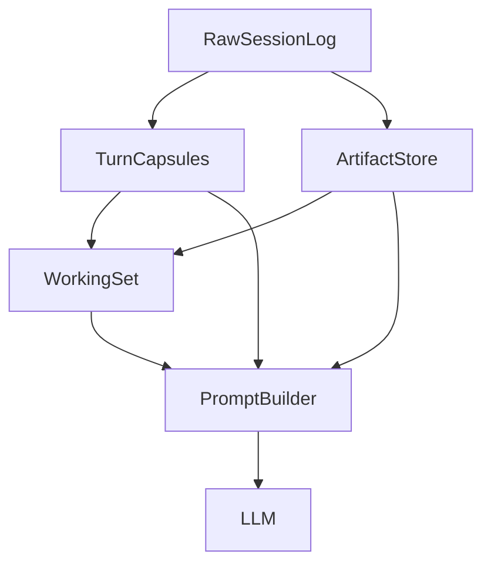
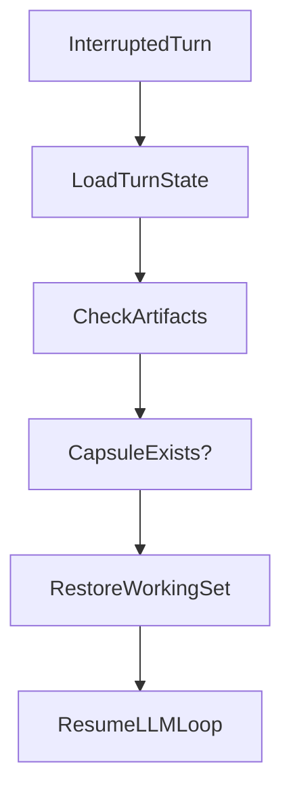

# 短期记忆改造方案架构文档

## 1. 背景

当前系统已经具备一定的上下文治理能力，核心链路主要分布在以下模块中：

- `nanobot/session/manager.py`：保存完整会话日志，并提供 `last_consolidated` 视图
- `nanobot/agent/context.py`：组装 system prompt、history 与 runtime context
- `nanobot/agent/runner.py`：执行 tool loop，并做 orphan repair、tool result budget、microcompact、history snip
- `nanobot/agent/loop.py`：负责多轮执行、checkpoint、pending user turn 恢复
- `nanobot/agent/autocompact.py`：对 idle session 做压缩与恢复摘要注入
- `nanobot/agent/memory.py`：负责 `MemoryStore`、`Consolidator`、`Dream`
- `nanobot/agent/promoter.py`：负责 `Promoter`

其中 `loop.py` 还会把 `Consolidator / Dream / Promoter` 组装进主执行链路。

这些基础已经解决了“能跑”和“基本可恢复”的问题，但如果目标提升到：

1. 长期任务稳定运行
2. 多轮 tool calling 下上下文不快速膨胀
3. 不重复把无用内容反复发给模型

那么当前短期记忆的核心问题仍然存在：

- 短期上下文仍然过度依赖原始 `session.messages`
- tool 输出的在线压缩过于粗糙，容易丢语义
- prompt 裁剪仍偏“事后补救”，缺少显式工作集
- 恢复能力更多是“消息修补”，不是“回合状态恢复”

因此，本方案的目标不是继续增强“超预算后再截断”的机制，而是把短期记忆升级为一套显式工作集系统。

## 2. 改造目标

### 2.1 核心目标

- **稳定性**：支持长期任务、多轮工具调用、任务中断恢复，不轻易丢工作状态
- **上下文简洁性**：短期上下文增长速度低于原始消息增长速度
- **token 节省**：避免把大工具输出、已消费信息、低价值历史反复发送给模型

### 2.2 设计原则

- **日志层与工作层分离**：原始消息保真存储，模型只看工作集
- **先结构化，再压缩**：优先把回合整理成结构化 capsule，而不是直接截断原始消息
- **大结果句柄化**：tool 大输出进入 artifact store，prompt 仅保留 digest + 引用
- **恢复以状态为中心**：从“恢复消息链”升级到“恢复回合状态”
- **在线层与长期记忆层解耦**：短期记忆改造不依赖 Dream / Promoter 成功与否
- **当前单 agent 优先，边界保持可扩展**：本阶段不以 `subagent` 为核心前提，但 artifact / capsule / working set 的数据边界不能写死为“只来自 tool”

### 2.3 范围边界

本方案当前聚焦**单 agent 场景下的短期 context 明细化与压缩**，优先解决 raw history 膨胀、tool 结果不可复用、prompt 缺少预算层次、恢复状态粒度不足等问题。

当前代码库已经具备基础 `subagent` 能力（`SubagentManager` + `SpawnTool` + 主循环中的回灌处理），但它不作为本阶段短期记忆改造的核心设计前提。当前只要求：

- 不把数据模型写死成“只能承载 tool result”
- 不把回合结构写死成“只有单一执行来源”
- 不把恢复状态写死成“只能围绕消息链修补”

也就是说，本期先解决主 agent 的短期记忆质量问题，同时为后续更深入地利用 `subagent` 留好兼容边界。

## 3. 现状问题

### 3.1 原始历史仍是短期记忆主载体

当前 `Session.get_history()` 仍然以 `session.messages[last_consolidated:]` 为基础视图。
这意味着短期记忆的膨胀仍然主要受消息总量驱动，而不是受“当前任务所需信息量”驱动。

换句话说，系统现在更像是在说“最近发生过什么都先塞进 prompt”，而不是“当前这一步真正需要什么信息”。

**例子：**

假设用户让 agent 连续完成下面几件事：

1. 先读 6 个文件理解架构
2. 再跑一次测试
3. 然后修一个接口字段错误
4. 最后补一段文档说明

对人来说，到了第 4 步，真正需要的可能只有：

- 最终修复了哪个字段
- 测试是否通过
- 文档要写给谁看

但对当前实现来说，前面“读过哪些文件、每次 read_file 的返回、测试中间日志、修 bug 过程里的来回推理”都会继续作为短期历史的主要组成部分残留在上下文里。结果就是：

- prompt 很容易被前面的大量操作记录挤满
- 当前任务真正关键的信息反而没有被显式提炼出来
- 模型会持续看到很多“曾经相关、现在未必相关”的旧内容

这本质上是把“原始事件流”当成了“可直接消费的工作记忆”。

### 3.2 tool 结果压缩过于粗粒度

`runner._microcompact()` 当前会把旧工具结果替换成：

- `[read_file result omitted from context]`
- `[exec result omitted from context]`

这种方式虽然省 token，但问题是：

- 模型失去了仍可能必要的证据
- 容易触发重复读取、重复搜索、重复执行
- 长任务中会导致“记得调用过，但不记得结果是什么”

**例子：**

比如 agent 刚刚：

- 用 `read_file` 读过某个配置文件，发现超时参数是 `timeout=30`
- 用 `exec` 跑过测试，看到失败点在 `test_retry_policy`

过一会这些 tool 结果如果都被压成：

- `[read_file result omitted from context]`
- `[exec result omitted from context]`

那模型还能记住“我好像看过一个配置文件，也好像跑过一次测试”，但很可能已经不记得：

- 到底是哪一个文件
- 超时值具体是多少
- 失败测试的名字是什么
- 错误栈里最关键的一行是什么

于是下一步就容易出现两种低效行为：

1. 再次读取同一个文件，只为重新确认 `timeout=30`
2. 再跑一遍测试，只为重新找回失败位置

也就是说，当前压缩保住了“动作发生过”，但没有保住“动作产出的可复用结论”。

### 3.3 prompt 组装缺少显式预算层次

当前 `ContextBuilder.build_messages()` 更偏向于：

- system prompt
- history
- 当前 user message

而不是：

- 固定前缀
- 当前工作集
- 最近真实回合
- 少量历史胶囊
- 必要时再 hydrate 详细 artifact

这会导致 prompt 体积与 raw history 强耦合。

**例子：**

假设一次对话里同时存在三类信息：

- 固定不变的 system 约束
- 当前正在修改的 2 个文件
- 之前 20 轮历史里的大量探索记录

对人来说，进入“现在开始写代码”这个阶段时，优先级通常非常明确：

1. 先看规则和当前目标
2. 再看正在改的文件和最新结论
3. 只有需要追溯时，才回头翻更早的历史

但如果 prompt 组装没有显式预算层次，实际效果就会变成“大家一起竞争 token 空间”：

- 最近探索历史可能占掉大量预算
- 当前工作集拿不到稳定保留空间
- 真正重要的细节只能靠运气留在上下文里

最终会出现一种很常见的体感：模型看起来“好像知道整个对话”，但真正开始落代码时，又会漏掉眼前最关键的约束。

### 3.4 恢复机制仍偏消息修复

当前 `loop.py` 的 checkpoint / pending user turn 恢复能力已经不错，但主要解决的是：

- tool result 丢失
- assistant/tool 断链
- user message 提前落盘

它还不是显式的 turn-level 状态机，因此在复杂多轮任务中，恢复精度仍受限。

**例子：**

假设 agent 正在执行一个较长任务：

1. 先搜索相关实现
2. 再读取 3 个文件
3. 计划修改其中 2 个文件
4. 修改完后跑测试
5. 最后整理总结回复

如果在第 3 步和第 4 步之间进程中断，当前恢复机制通常能做到：

- 知道最近有哪些消息已经写入
- 尽量把 assistant/tool 链补完整
- 避免把用户这轮输入弄丢

但它未必能非常清楚地恢复“这个回合当前进行到哪一个阶段”：

- 是还没开始改文件，还是已经改完一个文件？
- 测试是还没跑，还是跑了一半？
- 当前要恢复的是“继续执行”，还是“重新规划这轮任务”？

所以现有恢复更像是在修复消息链的一致性，而不是恢复一个“任务执行状态”。对简单场景已经够用，但一旦任务跨多个步骤、多个工具、多个中间结论，恢复后的行为就可能变得不够稳定。

## 4. 总体方案

本方案将短期记忆拆成 5 层：

1. **Raw Session Log**
2. **Artifact Store**
3. **Turn Capsule**
4. **Working Set**
5. **Budgeted Prompt Assembly**

整体关系如下：



核心思想：

- `session.messages` 继续保存事实
- tool 大输出进入 `ArtifactStore`
- 每个回合结束后生成结构化 `TurnCapsule`
- 当前任务依赖的信息收敛到 `WorkingSet`
- prompt 构建时优先加载 `WorkingSet`，不是优先加载全部历史

## 5. 核心组件设计

### 5.1 Raw Session Log

#### 目标

继续作为事实源，不承担“直接给模型看的上下文”职责。

#### 设计要求

- 继续沿用 `Session.messages`
- 保留完整 user / assistant / tool 事件
- 保留合法 tool chain 边界信息
- 不因为在线压缩而破坏原始事实

#### 结论

这一层基本沿用 `nanobot/session/manager.py` 现状，不做大改。

### 5.2 Artifact Store

#### 目标

把大执行产物从 prompt 中剥离出去，改成“句柄 + 摘要”的方式管理。

#### 适用对象

- 当前优先覆盖各类 tool result：
- `read_file`
- `grep`
- `glob`
- `exec`
- `web_fetch`
- `web_search`
- 后续可扩展到 MCP / browser / notebook / subagent report 等来源

当前阶段实现上可以先围绕 tool result 落地，但 `ArtifactStore` 的抽象不应被命名和字段设计锁死为“只能存工具输出”。

#### 存储内容

每个 artifact 至少包含：

- `artifact_id`
- `source_type`
- `source_name`
- `created_at`
- `source_input`
- `raw_ref`
- `digest`
- `size_chars`
- `reuse_hint`

#### 示例

```json
{
  "artifact_id": "art_read_file_001",
  "source_type": "tool",
  "source_name": "read_file",
  "created_at": "2026-04-19T12:00:00Z",
  "source_input": {
    "path": "nanobot/agent/runner.py"
  },
  "raw_ref": ".nanobot/tool-results/cli_test/call_123.txt",
  "digest": {
    "summary": "读取了 runner.py，关注点在 context governance、microcompact、history snip。",
    "key_entities": ["AgentRunner", "_microcompact", "_snip_history"],
    "range_hint": "full file"
  },
  "size_chars": 18420,
  "reuse_hint": "如果后续继续讨论 runner 上下文治理，优先复用该 artifact"
}
```

#### 关键策略

- 原始大输出只保存在磁盘
- prompt 中默认只注入 digest
- 只有明确需要时才重新 hydrate 原始内容
- 如来源是 tool，可额外记录 tool-specific 字段；但这些字段应是扩展信息，不应替代通用 source 抽象

### 5.3 Turn Capsule

#### 目标

将一个完整 user turn 结构化为可复用、可裁剪的最小工作单元。
当前阶段默认是一轮用户请求对应一个主 capsule，但结构设计上不应假定“这一轮只有 tool 参与”。

#### 为什么需要

当前系统裁的是“消息”，而不是“回合语义单元”。
Turn Capsule 的作用，是让系统今后裁掉的不是未经整理的原始消息，而是已经整理好的任务胶囊。

#### 结构建议

```json
{
  "turn_id": "turn_20260419_001",
  "timestamp": "2026-04-19T12:05:00Z",
  "owner": {
    "kind": "agent",
    "id": "main"
  },
  "user_goal": "分析短期记忆改造方向",
  "assistant_intent": "先调研现有实现，再输出架构方案",
  "outcomes": [
    "读取了 context.py / runner.py / loop.py / autocompact.py",
    "确认 microcompact 过粗、working set 缺失"
  ],
  "decisions": [
    "短期记忆应改成 working set 模型",
    "tool 大输出要 artifact 化"
  ],
  "open_questions": [
    "working set 是否持久化为 sidecar 文件",
    "resume 时是否自动 hydrate 相关 artifacts"
  ],
  "artifact_refs": [
    "art_read_file_runner",
    "art_read_file_context"
  ],
  "next_expected_action": "输出 markdown 架构方案"
}
```

#### 特性

- 小而稳定
- 可排序、可选择性注入
- 比 raw summary 更适合作为在线短期记忆素材
- `outcomes` 使用通用命名，当前可承载 tool 结果，未来也可承载其他执行来源的产出摘要

### 5.4 Working Set

#### 目标

显式维护“模型当前真正需要知道什么”。

#### 定位

它不是长期记忆，也不是原始日志，而是**当前任务工作集**。

#### 建议内容

```json
{
  "session_key": "cli:test",
  "active_task": "设计短期记忆改造架构",
  "task_stage": "architecture_draft",
  "active_goals": [
    "提高长期任务稳定性",
    "减少上下文膨胀",
    "降低重复 token 消耗"
  ],
  "open_loops": [
    "确定短期记忆数据结构",
    "确定与现有 Session/Runner 的整合边界"
  ],
  "relevant_capsules": [
    "turn_20260419_001",
    "turn_20260419_002"
  ],
  "relevant_artifacts": [
    "art_read_file_runner",
    "art_read_file_loop"
  ],
  "last_user_focus": "先输出 markdown 文档",
  "budget_cache": {
    "working_set_tokens": 320,
    "capsule_tokens": 540,
    "recent_turn_tokens": 780
  }
}
```

#### 作用

`WorkingSet` 将成为 prompt 组装的第一优先级来源。
也就是说，今后“短期记忆”不再等价于“最后几百条消息”，而是等价于“当前工作集 + 少量最近真实回合”。

#### 设计约束

- `WorkingSet` 的输入源可以先以 `turn capsule + artifact digest` 为主
- 但写入入口应保持统一，不要把“谁产生结果就直接塞进 prompt”写成固定路径
- 当前阶段即使只有主 agent + tools，也建议预留统一的 ingest / adopt 语义，避免未来新增来源时重写工作集装配逻辑

### 5.5 Budgeted Prompt Assembly

#### 目标

将 prompt 组装改造成有层次、有预算、有降级路径的流水线。

#### 推荐组装顺序

1. **System Prefix**
   - identity
   - bootstrap files
   - always skills

2. **Working Set**
   - active task
   - open loops
   - relevant capsules refs
   - relevant artifact refs

3. **Recent Raw Turns**
   - 最近 1~2 个完整真实回合
   - 保留真实工具调用链，利于稳定续跑

4. **Selected Turn Capsules**
   - 只注入和当前任务有关的 capsule
   - 按相关性与预算选择

5. **Artifact Digests**
   - 注入摘要而不是原始大输出

6. **Current User Message**
   - runtime context
   - 当前输入

#### 优先裁剪顺序

- 先裁剪低相关 capsule
- 再裁剪低相关 artifact digest
- 再裁剪较旧 raw turn
- 不轻易裁剪 working set
- 不裁剪稳定 system prefix

#### 结果

上下文膨胀将从“按消息条数增长”变成“按活跃任务复杂度增长”。

## 6. 稳定性设计

### 6.1 Turn State Machine

为每一轮新增显式状态机：

- `collecting_user`
- `awaiting_model`
- `awaiting_tools`
- `finalizing_turn`
- `completed`
- `interrupted`

#### 状态持久化内容

- `turn_id`
- 当前阶段
- 已声明 tool calls
- 已完成 tool results
- 已生成的 artifact refs
- 是否已生成 turn capsule
- 是否已刷新 working set
- 可选的 `task_ref` / `execution_ref`

#### 目的

当进程中断时，恢复逻辑不再只是：

- 补 tool message
- 补 assistant placeholder

而是能知道：

- 这轮任务做到哪一步
- 哪些结果已经稳定落盘
- 是否应该重新请求模型
- 是否应该仅补尾部收口

### 6.2 断点恢复策略



#### 恢复原则

- 优先恢复状态，而不是重放原始历史
- 已经有 artifact 的 tool 结果不重复执行
- 已经完成的回合不重复生成 capsule
- 已完成工作集刷新则直接复用

## 7. token 优化策略

### 7.1 从“内容重复发送”转成“句柄复用”

优化对象：

- 大 tool 输出
- 已经被消费过的旧工具结果
- 只用于历史解释的中间结果
- 当前任务不相关的历史回合

#### 原则

- 原始内容只存一次
- 在线上下文传 digest
- 必要时按引用回填

### 7.2 提高 prefix 稳定性

当前 `context.py` 中 system prompt 的组成已经较稳定，但 working memory 和 skills summary 仍可能波动较大。
改造后应尽量做到：

- identity / bootstrap / always skills 放前缀
- working set / capsules / artifact digests 放后缀
- 每轮变化部分尽量局部化

这样有利于 provider cache 命中，进一步节省 token。

### 7.3 工具级 digest 替换占位符

替代当前：

- `[read_file result omitted from context]`

改为：

- `read_file("runner.py") -> 关注点: AgentRunner, _microcompact, _snip_history, artifact=art_xxx`

这样既保留关键信号，又不需要反复重发全文。

## 8. 与现有模块的整合

### 8.1 `nanobot/session/manager.py`

职责保留：

- 原始消息持久化
- 合法边界处理

新增：

- sidecar state / working set 的加载与保存接口
- turn capsule 索引支持

### 8.2 `nanobot/agent/runner.py`

重点改造：

- 将 `_microcompact()` 升级为 tool-aware digest 机制
- 把大输出统一注册到 artifact store
- 保留现有 orphan repair / backfill / snip 的兜底作用

### 8.3 `nanobot/agent/context.py`

重点改造：

- 从“history 驱动”改成“working set 驱动”
- 引入分层预算 prompt assembly
- 支持 selected capsules / artifact digests 注入

### 8.4 `nanobot/agent/loop.py`

重点改造：

- 在 turn 完成时生成 capsule
- 更新 working set
- 维护 turn state machine
- 中断恢复时优先读取 turn state

这里建议从第一版开始就把状态对象设计成“可附着执行来源元信息”，哪怕当前只有主 agent，也避免未来引入其他执行单元时需要重写状态持久化格式。

### 8.5 `nanobot/agent/autocompact.py`

重点改造：

- idle 压缩不再只产出自由文本 summary
- 优先产出结构化 capsule / state snapshot
- 恢复时注入 working set 级摘要，而不是临时自然语言摘要

### 8.6 `nanobot/agent/memory.py`

短期内不大动。
本方案优先只改在线短期记忆层，不改变 `memory.py + promoter.py` 共同组成的长期记忆权限边界。

补充说明：

- `memory.py` 当前承载 `MemoryStore`、`Consolidator`、`Dream`
- `Promoter` 当前位于 `promoter.py`
- 这几部分由 `loop.py` 在运行时组装

## 9. 分阶段实施

### Phase 1：引入 Artifact Store + Working Set

#### 目标

先解决重复大输出和上下文无序膨胀问题。

#### 范围

- `runner.py`
- `context.py`
- 新增 `short_memory.py` 或 `session_state.py`

#### 产出

- artifact digest
- working set sidecar
- prompt 分层预算初版

### Phase 2：引入 Turn Capsule

#### 目标

让在线短期记忆从“消息尾部”升级为“结构化回合胶囊”。

#### 范围

- `loop.py`
- `manager.py`
- `context.py`

#### 产出

- 每回合 capsule 生成
- capsule 选择性注入
- resume 与 capsule 协同

### Phase 3：引入 Turn State Machine

#### 目标

把恢复能力从消息修补升级到回合恢复。

#### 范围

- `loop.py`
- `runner.py`
- `manager.py`

#### 产出

- turn state 落盘
- 中断恢复 FSM
- 工具结果去重恢复

### Phase 4：整合 AutoCompact

#### 目标

让 idle compact 与 working set / capsule 统一。

#### 范围

- `autocompact.py`
- `context.py`
- `manager.py`

#### 产出

- 结构化 resume summary
- 更稳的跨 idle 恢复体验

## 10. 非目标

本方案暂不处理以下问题：

- 不把 `archive/history.jsonl` 直接变成 prompt 默认注入源
- 不改 Dream / Promoter 的权限模型
- 不在第一阶段引入向量数据库或语义检索系统
- 不把短期记忆直接做成长期人格记忆
- 不尝试用单个“全局摘要文件”替代 working set
- 不在本阶段围绕 `subagent` 重新设计执行编排；但要求当前数据边界对现有能力和未来扩展都保持兼容

## 11. 后续可扩展方向：Embedding / Hybrid RAG

### 11.1 为什么当前方案天然兼容后续检索增强

本方案虽然第一阶段不引入向量数据库或语义检索系统，但整体分层已经为后续检索增强预留了较好的扩展位：

- `Raw Session Log` 继续保存完整事实，可作为最终可追溯来源
- `Artifact Store` 让大结果具备稳定句柄，便于后续为 artifact 建索引
- `Turn Capsule` 将回合语义结构化，适合作为中粒度检索对象
- `Working Set` 已经把“当前模型真正需要知道什么”显式化，便于把检索结果作为候选补充，而不是直接替代主工作集
- `Budgeted Prompt Assembly` 已经具备分层注入与预算裁剪逻辑，便于未来把检索命中的 capsule / artifact digest 安全接入 prompt

也就是说，后续即使引入 `embedding`、关键词检索、时间约束过滤、rerank 或 `Hybrid RAG`，也不需要推翻当前方案的主链路，只需要在“选择哪些 capsule / artifact 进入 working set 或 prompt”这一层增加检索能力。

### 11.2 推荐的扩展方式

后续如果要增强长历史召回，建议优先检索以下对象，而不是直接对整段 `historyText` 做粗粒度召回：

1. **Turn Capsule**
   - 适合检索历史目标、关键结论、决策、未决问题
   - 语义密度高，通常比原始消息片段更适合做 embedding

2. **Artifact Digest**
   - 适合检索文件读取结果、测试失败摘要、搜索结果摘要、网页摘要
   - 能在不回灌原始大输出的前提下补充可复用证据

3. **必要时的 Raw Log Chunk**
   - 只作为兜底层
   - 当 capsule / digest 不足以支撑当前推理时，再按引用 hydrate 原始片段

检索方式上，建议采用分层组合而不是单一向量召回：

- 先用 metadata 过滤：如 `session_key`、`turn_id`、文件路径、tool 类型、时间窗口、任务阶段
- 再做 embedding 召回：查找语义相关的 capsule / digest
- 最后做关键词或规则 rerank：提高精确命中当前任务约束的概率

如果后续确实需要引入 `Hybrid RAG`，更推荐把它定义为：

- **候选补充层**，而不是默认主输入层
- **working set 的增强器**，而不是 `historyText` 的替代拼接器
- **按需追溯机制**，而不是“把所有相似历史重新塞回 prompt”的机制

### 11.3 推荐接入点

从当前设计边界看，后续检索增强最适合接在以下位置：

1. **Working Set 构建阶段**
   - 当当前 active task / open loops 信息不足时
   - 从历史 capsule / artifact digest 中召回高相关候选
   - 选中后写入 `relevant_capsules` / `relevant_artifacts`

2. **Prompt Assembly 阶段**
   - 在已有 `Working Set` 基础上追加少量检索命中结果
   - 仍然受预算层次控制
   - 默认注入 digest，不直接注入原始大块文本

3. **恢复阶段**
   - 当 turn resume 需要恢复更早上下文时
   - 可按当前 turn state 检索关联 capsule / artifact
   - 只补足恢复所需证据，不回放整段历史

### 11.4 需要显式避免的退化方向

后续引入检索能力时，需要避免系统重新退化回“history 中心”的旧路径：

- 不要把长 `historyText` 切块后直接作为主要召回对象
- 不要让向量召回结果绕过 `Working Set`，直接大段注入 prompt
- 不要把“语义相似”误当成“当前任务相关”
- 不要让检索层替代 turn capsule / artifact digest 这些结构化中间层

当前方案的核心收益，在于把“原始历史”降级为事实层，把“工作集”提升为模型主输入。后续检索增强应服务于这个目标，而不是反过来削弱它。

### 11.5 新增风险与约束

如果未来接入 `embedding` 或 `Hybrid RAG`，会额外引入以下风险：

#### 风险 1：召回内容语义相关，但对当前步骤无用

模型可能拿到“话题相似但任务阶段不匹配”的历史内容，造成注意力分散。

**对策：**

- 先做 metadata 过滤，再做向量召回
- 将 `task_stage`、文件路径、tool 类型、turn 时间窗纳入排序特征
- 控制每轮注入的检索结果数量与 token 上限

#### 风险 2：召回命中旧结论，覆盖当前最新状态

历史上正确的结论，可能已经被后续修改、测试或用户澄清推翻。

**对策：**

- 检索结果默认作为候选证据，不直接覆盖 working set 当前状态
- 对 capsule / artifact 保留时间戳与来源引用
- 排序时提升近期结果和已验证结果的权重

#### 风险 3：检索链路本身带来额外复杂度和时延

语义检索、混合排序、hydrate 都会增加在线路径复杂度。

**对策：**

- 第一阶段保持无检索主路径可独立工作
- 检索只在信息不足、需要追溯时按需触发
- 先从 capsule / digest 建轻量索引，再视收益决定是否升级到更复杂的 Hybrid RAG

#### 风险 4：结构化中间层质量不足，导致检索效果不稳定

如果 capsule 或 digest 写得过粗，后续即使有 embedding，也很难稳定召回真正有价值的信息。

**对策：**

- 先提升 capsule / digest 的字段质量，再考虑引入检索系统
- 优先保证 `user_goal`、`outcomes`、`decisions`、`artifact_refs` 等字段稳定
- 对重复 re-read / re-run 场景埋点，反向校准摘要质量

## 12. 风险与对策

### 12.1 风险：working set 漂移

如果 working set 维护不当，可能出现“当前任务状态与真实对话不一致”。

#### 对策

- working set 只存可验证字段
- 关键内容来自 turn capsule，不直接自由生成
- turn 完成后统一刷新，避免中途频繁重写

### 12.2 风险：artifact digest 过于简化

如果 digest 太短，模型可能仍然重复执行工具。

#### 对策

- 先做规则化 digest
- 对重复 re-read 场景埋点
- 只在高价值工具上逐步增强 digest 粒度

### 12.3 风险：状态机带来复杂度

turn state machine 会提升恢复能力，但也增加实现复杂度。

#### 对策

- 第一阶段不引入完整 FSM
- 先做 artifact + working set
- 等在线收益验证后，再升级恢复层

## 13. 验收指标

### 13.1 稳定性指标

- 50+ tool calls 长任务成功率
- 中断恢复成功率
- orphan tool chain 恢复率
- 任务中途跟进消息注入后的完成率

### 13.2 上下文控制指标

- 平均 `prompt_tokens` 增长斜率
- 单任务最大上下文峰值
- raw history 与实际 prompt 大小的比值

### 13.3 token 成本指标

- 重复 `read_file` / `web_fetch` 次数
- 大工具输出重复发送率
- `cached_tokens` 占比提升情况
- artifact digest 命中率

## 14. 建议的首期实现结论

如果只做一版最小可用改造，建议优先落地以下三项：

1. **Artifact Store**
2. **Working Set**
3. **Prompt 分层预算组装**

这是最小成本、最大收益的一步，因为它能先解决：

- tool 输出重复发送
- 短期上下文无序增长
- 长任务中模型“知道做过什么，但不知道结果”的问题

而且不会破坏现有 `Consolidator / Dream / Promoter` 的整体设计边界。

## 15. 总结

本方案的核心不是“把更多历史塞进上下文”，而是：

- 把**原始日志**和**模型工作集**分开
- 把**大工具输出**变成**artifact + digest**
- 把**回合历史**变成**turn capsule**
- 把**恢复机制**升级为**turn-level state recovery**
- 把 prompt 从“按消息堆叠”改成“按工作集装配”

当前实现主线仍然是主 agent 短期记忆优化，不额外把设计重心转向 `subagent`；但在 artifact、capsule、working set 和状态持久化的边界上，方案会避免把现有能力和未来扩展路径写死。

最终目标是让短期记忆从“超预算后被动压缩”升级为“面向长期任务的主动工作集系统”。
